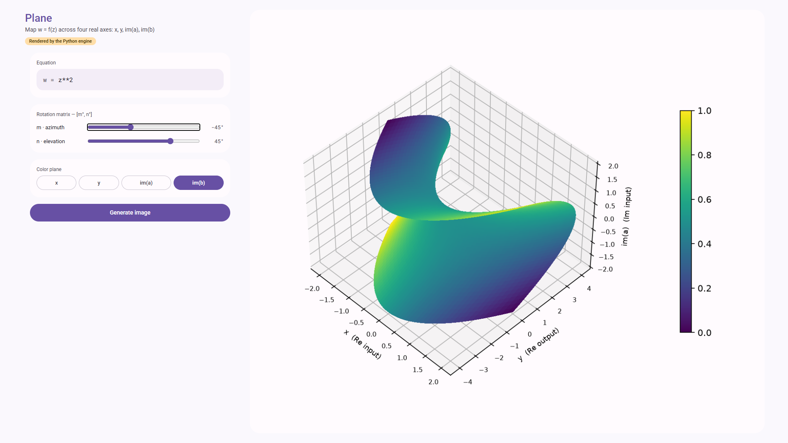

# Plane — complex function visualizer

A Material You–styled GUI where every number is crunched by a Python
backend. The browser only collects input (equation, rotation matrix,
color plane) and displays the PNG the server renders.



*`w = z**2`, Rotation_Matrix = [-45°, 45°], colored by im(b).*

## Project layout

```
plane_app/
├── app.py                 Flask app + numpy field computation + matplotlib rendering
├── templates/
│   └── index.html         GUI (fetch()'s the backend, no client-side math)
├── screenshots/
│   └── plane_app_screenshot.png
└── requirements.txt
```

## Run it

```
pip install -r requirements.txt
python app.py
```

Then open **http://127.0.0.1:5000** in a browser.

## How it works

1. `w = f(z)` where `z = x + i·a` is the input and `w = y + i·b` is the output.
2. The frontend sends `{equation, m, n, color}` to `POST /api/render`.
3. `app.py` builds the `x, a` grid with numpy, evaluates the equation
   (`z**2`, `sin(z)/z`, `1/z`, ... — only whitelisted names are allowed,
   everything else is rejected before it ever reaches `eval`), and hands
   the four real fields (x, y, im(a), im(b)) to matplotlib.
4. matplotlib renders the chosen three as the 3D axes and the fourth as
   color, rotated by `Rotation_Matrix = [m°, n°]` (m = azimuth, n =
   elevation), and returns a PNG as base64.
5. The image fills the output box in the browser.

## Controls

| Control | What it does |
|---|---|
| **Equation** | Any expression of `z`, e.g. `z**2`, `sin(z)/z`, `1/z`, `exp(z)` |
| **m · azimuth** slider | Horizontal camera rotation, -180° to 180° |
| **n · elevation** slider | Vertical camera tilt, -90° to 90° |
| **Color plane** | Choose which of x, y, im(a), im(b) maps to color — the other three become the 3D axes |
| **Generate image** | Runs the first render; after that, moving a rotation slider or switching color plane re-renders automatically |

## Layout

- **Narrow / mobile**: single column, controls stacked above the output box.
- **Laptop / wide screen (≥ 960px)**: two-column layout — controls fixed at
  520px on the left, output box fills the remaining width and viewport
  height on the right (see screenshot above).
